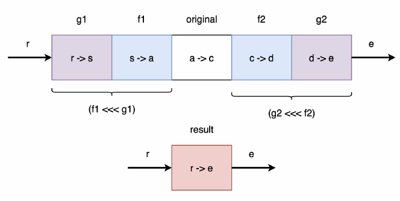
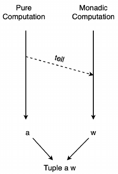
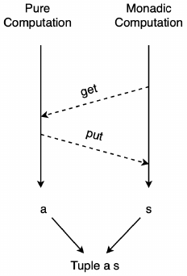

Page 98:
- We can freely move Parameters across the equals sign as long as we move the rightmost Parameter first
and maintain the correct order:
  ```
  f1 x y z = x + y z
  f2 x y   = \z → x y z
  f3 x     = \y z → x y z
  f4       = \x y z → x y z
  ```

- Remember that Type Signatures are Right-Associative which means they have implied Parentheses on the
right. This means that the Parentheses on `(a → c)` are redundant and we can remove them:
  ```
  compose ∷ ∀ a b c. (b → c) → (a → b) → a → c
  compose f g x = f (g x)
  ```

p. 101
- This syntax looks odd at first:
  ```
  \person → person { age = 18 }
  _ { age = 18 }
  ```

Chapter 5
- flip apply:
  - flip: `(a' → b' → c') → b' → a' → c'`
  - apply: `(a → b) → a → b`
  - flip apply:
    - `(a' → b' → c') = (a → b) → a → b`
    - `f = (a → b) = a'`
    - `a = b'`
    - `b = c'`
    - ⇒ (into) flip: `(f → a → b) → (a → f → b)`

- Page 182: 5.25. Local Function Type Signatures
  - cp. Haskell's `{-# LANGUAGE ScopedTypeVariables #-}`

- Page 184/305: Natural transformation with `~>` from one functor to another (e.g. `reverse`)
    ```
    newtype NonEmptyList a = NonEmptyList (NonEmpty List a)
    toList ∷ NonEmptyList ~> List
    ```
- Page 190: `filter` filters in - not out!
- Page 194: Point-free
  - Remember, composition only works with Functions waiting for a single Parameter.
  - `f $ g a` ≡ `f <<< g`
  - Function application ($) gets replaced with function composition (<<<) during Eta-reduction.
  - In Haskell the same but also: `f $ g a` ≡ `f . g`

- Page 207/213: Recursion "trick":
  - `takeEnd`
  - `dropEnd`
  - `unzip`

- Page 223:
  - A type class creates a Constraint! It's not a type, but restricts the type!
    ```
    ghci> :i Show
    type Show ∷ * → Constraint     # type - actually its kind - of the type class Show
    class Show a where              # Show is a type class
      show ∷ a → String

    ghci> :k Show
    Show ∷ * → Constraint
    ```
  - Type classes are used as Constraints!
    ```
    getDirections ∷ ∀ a. (Show a, HasAddress a) ⇒ a → Directions
    ```

- Page 225:
  - You can have multiple Constraints in a single Type Signature:  
    `getDirections ∷ ∀ a. Show a ⇒ HasAddress a ⇒ a → Directions`
  - You can also define multiple Constraints using Parentheses separating the Typeclasses by commas:  
    `getDirections ∷ ∀ a. (Show a, HasAddress a) ⇒ a → Directions`
  - Tip: Revert to the more verbose signature when type signature spans multiple lines:
    ```
    getDirections
    ∷ ∀ a
    . Show a
    ⇒ HasAddress a
    ⇒ a
    → Directions
    ```
- Page 227:
  - Every typeclass method must have its polymorphic parameter in its type signature.

- Page 237:
  - Deriving `Show` instances:
    ```
    import Data.Generic.Rep (class Generic)
    import Data.Show.Generic (genericShow)

    derive instance genericSomeType ∷ Generic SomeType _

    instance showSomeType ∷ Show SomeType where
      show = genericShow
    ```

- Page 244:
  - Instance Chaining:
    ```
    class IsRecord a where
      isRecord ∷ a → Boolean

    instance isRecordRecord ∷ IsRecord (Record a) where
      isRecord _ = true
    else instance isRecordOther ∷ IsRecord a where
      isRecord _ = false
    ```

- Page 245:
  - Orphaned Instances
  - What we need is an authoritative Definition and there really is only two places of authority:
    - the module where the typeclass is defined and
    - the module where the type is defined.
  - We need a way to control either the Typeclass or the Type.
    - You can use Newtypes for data types you don't control.

- Page 250:
  - [Fundeps/Functions Dependencies](https://stackoverflow.com/a/20040343/365425)

- Page 311:
  - Type aliases are nothing more than macros, i.e. you can think of the right-hand side as replacing everywhere the left-hand side is used in your code.
    ```
    type Abelian a b = Group a ⇒ Commutative a ⇒ b            -- looks strange
    find ∷ ∀ a. Abelian a (Set a → Maybe a)                  -- this is how it's used (looks pleasant)
    find ∷ ∀ a. Group a ⇒ Commutative a ⇒ Set a → Maybe a    -- this is what it expands to
    ```

- Page 317:
  - This means that the Expression, `\_ → zero`, takes an `a` (which it ignores) and returns a `b`, in this case zero.
  - This shows that the right-hand zero is `b`'s zero. And so there's no infinite loop here.
    ```
    instance Semiring b ⇒ Semiring (a → b) where
      add f g x = f x + g x    -- RHS: Adding b's
      zero = const zero        -- the same: zero = \_ → zero
    ```

- Page 344:
  - Fold is generalized way to iterate with state. Think of accumulator.
  - A major limitation of folds is that they do NOT short-circuit.
  - `fold` → `Catamorphism` = break down structure, `unfold` → `Anamorphism` = build up structure
  - But folds can also build new structure while breaking down the old structure: break down a list while generating a map.
  - [Unfolds in `Series of FP concepts`](https://functional.works-hub.com/learn/number-anamorphisms-aka-unfolds-explained-50e1a)
  - `foldr ∷ (a → b → b) → b → t a → b` -- accumulator b on the right
  - `foldl ∷ (b → a → b) → b → t a → b` -- accumulator b on the left
  - The functions in `foldr` and `foldl` are flipped.
    ```
    foldr (-) 99 [1, 2, 3] == 1 - (2 - (3 - 99)) == -97   -- foldr is right-associative
    foldl (-) 99 [1, 2, 3] == ((99 - 1) - 2) - 3 ==  93   -- foldl is left-associative
    ```
  - `foldl` is more efficient than `foldr` since it is tail recursive.
  - [Additional Exercises](http://www.cs.uu.nl/docs/vakken/fp/2020/exercises/foldr.html)

- Page 378:
  - Foldable for Trees: if you started to write `foldr` and then `foldl`, you may have come to the conclusion that these functions both need to have the SAME traversal logic.
  - ⇒ Convert tree to a list:
    - `Depth-first` favoring the `left side` of the tree
    - `Breadth-first` favoring the `right side` of the tree

- Page 389:
  - Any type constructor that takes one or more type parameters is a high-kinded type, e.g. Maybe a, List a, Either a b, ...
  - If value ~ type ⇒ function ~ higher-kinded type

- Page 394:
  -  So while the function is called map, many times we say `map over`, e.g. we `map f over a list`.
     ```
     class Functor f where
       map ∷ ∀ a b. (a → b) → f a → f b
     ```
  - Interpretation of `map`:
    - lift function into functor: `(a → b) → (f a → f b)`
    - apply function inside functor: `(a → b) → f a → f b`

- Page 415:
  - When trying to create a functor instance for a higher-kinded type that has multiple type parameters, then all of them are held constant except for the **RIGHTMOST** type parameter.

- Page 437:
  - Explanation why this does **NOT** compile!
    ```
    instance functorEither ∷ Functor (Either a) where
      map f (Right x) = Right $ f x
      map _ left = left
    ```
  - But this does!
    ```
    instance functorEither ∷ Functor (Either a) where
      map _ (Left err) = Left err
      map f (Right x) = Right $ f x
    ```

- Page 457:
  - When we map over a function type we **compose** the new function.
  - When we map over a value type we just **apply** the given function to the value.

- Page 461:
  - Examples for function composition with covariant and contravariant functions!
    ```
    a → Int → Int    -- contravariant (- polarity  -)
    Int → Int → a    -- covariant     (+ polarity ++)
    (a → Int) → Int  -- covariant     (+ polarity --)
    (Int → a) → Int  -- contravariant (- polarity -+)
    ```
  - Covariant ⇒ maps output
  - Contravariant ⇒ maps input
- Page 482:
  - Creating a type operator:
    ```
    infixr 6 type Tuple as &
    tup ∷ ∀ a b. a → b → a & b
    tup x y = Tuple x y
    ```
  - (→) is a type operator:
    - infix: a → b
    - prefix: (→) a b

- Page 483:
  - Function functor is just function composition:
    ```
    instance functorFn ∷ Functor ((→) r) where
      map f g = f <<< g  -- map = (<<<) ⇒ map = compose
    ```

- Page 486:
  - Profunctor: contravariant in the first Parameter (maps INPUTS), covariant in the second (maps OUTPUTS)
    ```
    class Profunctor p where
      dimap ∷ ∀ a b c d. (b → a) → (c → d) → p a c → p b d
    ```
  - Profunctor for functions:
    - first map input, then apply original function, then map output
    ```
    instance profunctorFn ∷ Profunctor (→) where
      dimap ∷ ∀ a b c d. (b → a) → (c → d) → (a → c) → (b → d)
      dimap f g h = g <<< h <<< f
    ```
    - Profunctor laws:
    ```
    dimap identity identity = identity
    dimap (f1 <<< g1) (g2 <<< f2) = dimap g1 g2 <<< dimap f1 f2
    ```
    

- Page 529:
  - Difference between PureScript and Haskell:
    ```
    class Functor f ⇒ Applicative f where
      pure ∷ a → f a
      (<*>) ∷ f (a → b) → f a → f b
    ```
    - In Haskell, constraints on classes have the same forward arrow as constraints on functions.
    - In Haskell, ∀ a is implied.
    - In Haskell, binary operators do not have to be aliased.

- Page 535:
  - We can write apply in terms of map, and we can write map in terms of apply.
    ```
    pure f <*> x = f <$> x
    ```
  - But don't do both at the same time ⇒ infinite loop
  - We have to explicitly write the `map` function or the `apply`. We can write one in terms of the other, but not both.
  - `liftA1 f x = pure f <*> x`
    - You can write a default implementation with `liftA1` for functors:
      ```
      instance Functor F where
        map = liftA1
      ```

- Page 544:
  - Validation with Applicatives:
  - We can map `fullName` over `Either String String` since the second parameter of `Either String String` is `String`!

    ```
    -- original pure function
    fullName ∷ String → String → String → String
    fullName first middle last = first <> " " <> middle <> " " <> last

    -- then we find out that those name strings, which come from an SQL database/webform, can be NULL
    errIfMissing ∷ Maybe String → String → Either String String
    errIfMissing Nothing  errMsg = Left errMsg
    errIfMissing (Just s) _      = Right s

    -- leveraging the original pure function
    fullNameEither ∷ Maybe String → Maybe String → Maybe String → Either String String
    fullNameEither first middle last =
          fullName <$> (first `errIfMissing` "First name missing")
                   <*> (middle `errIfMissing` "Middle name missing")
                   <*> (last `errIfMissing` "Last name missing")
    ```

- Page 548:
  - Functors **cannot** by themselves have effects, i.e. once a `Just` always a `Just`, once a `Nothing`, always a `Nothing`.
  - Applicatives **can** have effects, i.e. a `Just` can become a `Nothing` and a `Right` a `Left`.

- Page 551:
  - Type class `Traversable`
    ```
    class (Functor t, Foldable t) <= Traversable t where
      traverse ∷ ∀ a b m. Applicative m => (a → m b) → t a → m (t b)
      sequence ∷ ∀ a m. Applicative m => t (m a) → m (t a)
    ```
  - Example:
    ```
    type ProductId = Int

    -- get product from an SQL database
    getProduct ∷ ProductId → Maybe Product
    ...

    -- get all subproducts for a complex product
    -- if at least one product is not available → Nothing
    getAllSubproducts ∷ List ProductId → Maybe (List Product)
    getAllSubproducts = traverse getProduct
    ```
  - `traverse` transforms functions:
    ```
     ProductId  → Maybe  Product  ⇒
    [ProductId] → Maybe [Product]
    ```
  - `sequence` swaps outer and inner:
    ```
    [Maybe Product] ⇒ Maybe [Product]

    List  (Maybe Product) ⇒
    Maybe (List  Product)
    ```
  - `sequence = traverse identity`

- Page 569:
  - Different ways to create a Functor instance. Using `Either a b` as an example:
    - Explicit implementation:
      ```
      instance Functor (Either a) where
        map _ (Left a) = Left a
        map f (Right b) = Right $ f b
      ```
    - Using [`liftA1`](https://pursuit.purescript.org/packages/purescript-prelude/6.0.0/docs/Control.Applicative#v:liftA1):
      ```
      instance Functor (Either a) where
        map = liftA1
      ```
    - Derive instance:
      ```
      derive instance Functor (Either a)
      ```

- Page 577:
  - `newtype Validation err result = Validation (Either err result)`
  - We are simply just wrapping Either in a newtype. This will allow us to leverage Either's implementation when it suits us, i.e. when Validation's behavior is identical to Either, we'll tell the compiler to derive an instance using newtype.
  - We also have the option of overriding certain things we don't like about Either, e.g. how it short-circuits in apply.

- Page 582:
  - Defining Row Types:
    ```
    type FamilyAgesRow r = (fatherAge ∷ Age, motherAge ∷ Age | r)
    type FamilyNamesRow r = (fatherName ∷ String, motherName ∷ String | r)
    ```
    Note the parentheses! (No brackets or the like.)
  - Using/extending Row Types in `Extensible Records`:
    ```
    newtype FamilyAges = FamilyAges { | FamilyAgesRow () }
    newtype Family     = Family     { | FamilyAgesRow (FamilyNamesRow ()) }
    ```
    () = empty row ⇒ this is the `r` in the Row Type
  - This is syntactic sugar for:
    ```
    newtype Family     = Family     { Record (FamilyAgesRow (FamilyNamesRow ())) }
    ```
  - See also [Records in PureScript](https://github.com/purescript/documentation/blob/master/language/Records.md)

- Page 654:
  - Functions of the form `a → m b` are commonly referred to as `monadic functions` or `effectful functions`. Think of functions with side-effects.

- Page 655:
  - `composeKleisli` is for monads what `composeFlipped` is for functions.
  - Note the `≡`; this is not actual code!
    ```
    composeFlipped ∷ ∀ a b c.              (a →   b) → (b →   c) → (a →   c)
    composeFlipped f g ≡ f >>> g

    infixr 9 composeFlipped as >>>

    composeKleisli ∷ ∀ a b c m . Monad m ⇒ (a → m b) → (b → m c) → (a → m c)
    composeKleisli f g ≡ f >=> g

    infixr 1 composeKleisli as >=>
    ```
  - This are the actual implementations:
    ```
    composeFlipped f g a ≡ g   <<< f a  -- composeFlipped in terms of compose
    composeKleisli f g a ≡ f a >>= g    -- composeKleisli in terms of bind
    ```

  - `>=>` is the famous `fish operator`!
  - `>=>` ≡ `>>>` (composeKleisli ≡ composeFlipped), `<=<` ≡ `<<<` (composeKleisliFlipped ≡ compose)
  - TODO: write down full type class hierarchy for monads in PureScript and Haskell

- Page 656:
  - Alternative Monad Implementation (typically found in Scala):
  - `join` ⇒ `flatten`
  - `bind` ⇒ `flatMap`
  - In PureScript `join` is written in terms of `bind`:
    ```
    join :: ∀ a m. m (m a) → m a where
    join m = m >>= identity
    ```
  - In Scala `bind` is written in terms of `join`
    ```
    flatMap :: ∀ a b m. Monad m ⇒ m a → (a → m b) → m b where
    flatMap x f = flatten $ map f x
    ```

- Page 662:
  - Haskell's and PureScript's Monad Implementation
  - Class hierarchy Haskell:
    ```
    Functor (fmap) ⇒ Applicative (pure, `<*>`) ⇒ Monad (`>>=`)
    ```
  - Class hierarchy PureScript:
    ```
                                    Applicative (pure)
    Functor (map) ⇒ Apply (apply) ⇒                    ⇒ Monad (no methods)
                                    Bind (bind)
    ```
  - In PureScript, factoring out `Bind` is helpful when something acts like a `Monad`, but breaks the monad laws.
    - In that case, a developer **SHOULD** only implement a `Bind` instance.
    - When a type has a monad instance, it's implying that it obeys the monad laws.

- Page 663:
  - Monad Laws:
    ```
    pure >=> g = g                      [Left Identity]
    f >=> pure = f                      [Right Identity]
    (f >=> g) >=> h = f >=> (g >=> h)   [Associativity]
    ```
  - `pure` acts like `identity` for Kleisli Composition:
    ```
    identity >>> g = g                  [Left Identity]
    f >>> identity = f                  [Right Identity]
    (f >>> g) >>> h = f >>> (g >>> h)   [Associativity]
    ```
- Page 685:
  - Writing `apply` in terms of `bind` with helper `ap`:
    ```
    ap :: ∀ a b m. Monad m => m (a -> b) -> m a -> m b
    ap mf mx = do
      f <- mf
      x <- mx
      pure $ f x
    ```
  - e.g. for Maybe:
    ```
    instance Apply Maybe where
    apply = ap
    ```
  - Possible Strategy for Implementing Monads:
    - Derive `Functor`.
    - Write `Apply` with `ap`.
    - `Applicative` is mostly trivial.
    - `Bind` is mostly trivial.
    - `Monad` is just a declaration.

- Page 691:
  - Writer Monad:
    - `newtype Writer w a = Writer (Tuple a w)`
      - Note a and w being switched in the Tuple (for historical reasons).
      - w = writer (aka. log)
      - a = result (of pure computation)

- Page 694:
  - In case you have difficulty finding a `Bind` instance you want to first write an `Apply` instance b/c both must be similar.

- Page 695:
  - The use of the `ap` trick could lead to additional constraint requirements.

- Page 696:
  - Writer API:
    ```
    tell :: ∀ w. w -> Writer w Unit
    listen :: ∀ a w. Writer w a -> Writer w (Tuple a w)
    pass :: ∀ a w. Writer w (Tuple a (w -> w)) -> Writer w a
    ```
    - `tell` = creates a log (that will be appended by `apply` or `bind`)
    - `listen` = get log and original result (in a Tuple)
    - `pass` = leave original result alone, change log with a function

- Page 700:
  - Some Monads and their `effects`:

    | Monad    | Effect                    |
    | -------- | ------------------------- |
    | Identity | No Effect                 |
    | Maybe    | Error Checking            |
    | Either   | Error Checking            |
    | Writer   | Log Appending             |
    | Reader   | Threading Read Only Value |
    | State    | Threading (Mutable) State |

  - The API functions cross the pure (**"foreground"**) and monadic (**"background"**) computations.
    

- Page 702:
  - Reader Monad:
    - `newtype Reader r a = Reader (r -> a)`
      - r = read-only value; will be passed to every function
      - a = result (of pure computation)
    - [Reader Example](https://github.com/mkohlhaas/Reader-Monad-Motivation)

- Page 709:
  - Beware of hidden infinite loops!
  - Think of using a helper function when dealing with function values in monads, e.g.
    ```
    -- Applicative Parser (p. 618)
    parse :: ∀ e a. Parser e a -> ParseFunction e a
    parse (Parser f) = f
    ```
    ```
    -- Reader Monad
    runReader :: forall r a. Reader r a -> r -> a
    runReader (Reader f) = f
    ```

- Page 712:
  - Reader API:
    ```
    ask :: ∀ r. Reader r r
    asks :: ∀ a r. (r -> a) -> Reader r a
    ```
    - `ask` = get reader
    - `asks` = typically returns part of a complex reader, e.g. from a record
      - in Haskell typically the reader is a record and the function is a field in the record:
        ```
        data Config = Config { verbose :: Bool }

        type ConfigM = Reader Config

        doSomethingSpecial :: ConfigM ()
        doSomethingSpecial = do
          vrb <- asks verbose
          ...
        ```

- Page 715:
  - State Monad:
    - `newtype State s a = State (s -> Tuple a s)`
      - s = state
      - a = result (of pure computation)
    - We can not map over `Tuple a s` b/c the order is wrong. (Adopted from Haskell.)

- Page 722:
  - State API:
    ```
    get :: ∀ s. State s s
    put :: ∀ s. s -> State s Unit
    modify :: ∀ s. (s -> s) -> State s s
    modify_ :: ∀ s. (s -> s) -> State s Unit
    ```
    - `get` = get current state
    - `put` = put new state
    - `modify` = change current state and returns it in the pure computation (saves a following `get`)
    - `modify_` = change current state but disregard the pure computation (returns unit)

    

- Page 732:
  - Author suggests starting with Applicatives before reaching for Monads!
