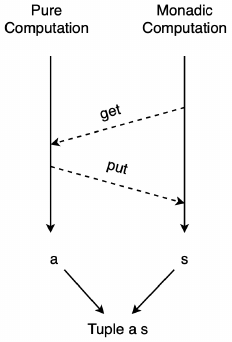
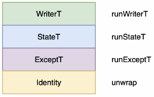

Page 98:
- We can freely move parameters across the equals sign as long as we move the rightmost parameter first and maintain the correct order:
  ```haskell
  f1 x y z = x + y + z
  f2 x y   = \z → x + y + z
  f3 x     = \y z → x + y + z
  f4       = \x y z → x + y + z
  ```

- Remember that type signatures are right-associative which means they have implied parentheses on the right.
- This means that the parentheses on `(a → c)` are redundant and we can remove them:
  ```haskell
  compose ∷ ∀ a b c. (b → c) → (a → b) → a → c
  compose f g x = f (g x)
  ```

p. 101
- This syntax looks odd at first:
  ```haskell
  \person → person { age = 18 }
  _ { age = 18 }
  ```

Chapter 5
- flip apply:
  - flip: `(a' → b' → c') → b' → a' → c'`
  - apply: `(a → b) → a → b`
  - flip apply:
    - `(a' → b' → c') = (a → b) → a → b`
    - `f = (a → b) = a'`
    - `a = b'`
    - `b = c'`
    - ⇒ (into) flip: `(f → a → b) → (a → f → b)`

- Page 182: 5.25. Local Function Type Signatures
  - cp. Haskell's `{-# LANGUAGE ScopedTypeVariables #-}`

- Page 184/305: Natural transformation with `~>` from one functor to another (e.g. `reverse`)
    ```haskell
    newtype NonEmptyList a = NonEmptyList (NonEmpty List a)
    toList ∷ NonEmptyList ~> List
    ```
- Page 190: `filter` filters in - not out!
- Page 194: Point-free
  - Remember, composition only works with functions waiting for a single parameter.
  - `f $ g a` ≡ `f <<< g`
  - Function application `($)` gets replaced with function composition `(<<<)` during eta-reduction.
  - In Haskell the same but also: `f $ g a` ≡ `f . g`

- Page 207/213: Recursion "trick":
  - `takeEnd`
  - `dropEnd`
  - `unzip`

- Page 223:
  - A type class creates a constraint! It's not a type, but restricts the type!
    ```haskell
    ghci> :i Show
    type Show ∷ * → Constraint     # type - actually its kind - of the type class Show
    class Show a where              # Show is a type class
      show ∷ a → String

    ghci> :k Show
    Show ∷ * → Constraint
    ```
  - Type classes are used as Constraints!
    ```haskell
    getDirections ∷ ∀ a. (Show a, HasAddress a) ⇒ a → Directions
    ```

- Page 225:
  - You can have multiple constraints in a single type signature:  
    `getDirections ∷ ∀ a. Show a ⇒ HasAddress a ⇒ a → Directions`
  - You can also define multiple constraints using parentheses separating the type classes by commas:  
    `getDirections ∷ ∀ a. (Show a, HasAddress a) ⇒ a → Directions`
  - Tip: Revert to the more verbose signature when type signature spans multiple lines:
    ```haskell
    getDirections
    ∷ ∀ a
    . Show a
    ⇒ HasAddress a
    ⇒ a
    → Directions
    ```
- Page 227:
  - Every typeclass method must have its polymorphic parameter in its type signature.

- Page 237:
  - Deriving `Show` instances:
    ```haskell
    import Data.Generic.Rep (class Generic)
    import Data.Show.Generic (genericShow)

    derive instance genericSomeType ∷ Generic SomeType _

    instance showSomeType ∷ Show SomeType where
      show = genericShow
    ```

- Page 244:
  - Instance Chaining:
    ```haskell
    class IsRecord a where
      isRecord ∷ a → Boolean

    instance isRecordRecord ∷ IsRecord (Record a) where
      isRecord _ = true
    else instance isRecordOther ∷ IsRecord a where
      isRecord _ = false
    ```

- Page 245:
  - Orphaned Instances
  - What we need is an authoritative definition and there really is only two places of authority:
    - the module where the type class is defined and
    - the module where the type is defined.
  - We need a way to control either the type class or the type.
    - You can use newtypes for data types you don't control.

- Page 250:
  - [Fundeps/Functions Dependencies](https://stackoverflow.com/a/20040343/365425)

- Page 311:
  - Type aliases are nothing more than macros, i.e. you can think of the right-hand side as replacing everywhere the left-hand side is used in your code.
    ```haskell
    type Abelian a b = Group a ⇒ Commutative a ⇒ b            -- looks strange
    find ∷ ∀ a. Abelian a (Set a → Maybe a)                  -- this is how it's used (looks pleasant)
    find ∷ ∀ a. Group a ⇒ Commutative a ⇒ Set a → Maybe a    -- this is what it expands to
    ```

- Page 317:
  - This means that the expression, `\_ → zero`, takes an `a` (which it ignores) and returns a `b`, in this case zero.
  - This shows that the right-hand zero is `b`'s zero. And so there's no infinite loop here.
    ```haskell
    instance Semiring b ⇒ Semiring (a → b) where
      add f g x = f x + g x    -- RHS: Adding b's
      zero = const zero        -- the same: zero = \_ → zero
    ```

- Page 344:
  - Fold is generalized way to iterate with state. Think of accumulator.
  - A major limitation of folds is that they do **NOT** short-circuit.
  - `fold` → `Catamorphism` = break down structure, `unfold` → `Anamorphism` = build up structure
  - But folds can also build new structure while breaking down the old structure: break down a list while generating a map.
  - [Unfolds in `Series of FP concepts`](https://functional.works-hub.com/learn/number-anamorphisms-aka-unfolds-explained-50e1a)
  - `foldr ∷ (a → b → b) → b → t a → b` -- accumulator b on the right
  - `foldl ∷ (b → a → b) → b → t a → b` -- accumulator b on the left
  - The functions in `foldr` and `foldl` are flipped.
    ```
    foldr (-) 99 [1, 2, 3] == 1 - (2 - (3 - 99)) == -97   -- foldr is right-associative
    foldl (-) 99 [1, 2, 3] == ((99 - 1) - 2) - 3 ==  93   -- foldl is left-associative
    ```
  - `foldl` is more efficient than `foldr` since it is tail recursive.
  - [Additional Exercises](http://www.cs.uu.nl/docs/vakken/fp/2020/exercises/foldr.html)

- Page 378:
  - Foldable for Trees: if you started to write `foldr` and then `foldl`, you may have come to the conclusion that these functions both need to have the **SAME** traversal logic.
  - ⇒ Convert tree to a list:
    - `Depth-first` favoring the `left side` of the tree
    - `Breadth-first` favoring the `right side` of the tree

- Page 389:
  - Any type constructor that takes one or more type parameters is a high-kinded type, e.g. `Maybe a`, `List a`, `Either a b`, ...
  - If value ~ type ⇒ function ~ higher-kinded type

- Page 394:
  -  So while the function is called `map`, many times we say `map over`, e.g. we `map f over a list`.
     ```haskell
     class Functor f where
       map ∷ ∀ a b. (a → b) → f a → f b
     ```
  - Interpretation of `map`:
    - Lift function into functor: `(a → b) → (f a → f b)`
    - Apply function inside functor: `(a → b) → f a → f b`

- Page 415:
  - When trying to create a functor instance for a higher-kinded type that has multiple type parameters, then all of them are held constant except for the **RIGHTMOST** type parameter.

- Page 437:
  - Explanation why this does **NOT** compile!
    ```haskell
    instance functorEither ∷ Functor (Either a) where
      map f (Right x) = Right $ f x
      map _ left = left
    ```
  - But this does!
    ```haskell
    instance functorEither ∷ Functor (Either a) where
      map _ (Left err) = Left err
      map f (Right x) = Right $ f x
    ```

- Page 457:
  - When we map over a function type we **compose** the new function.
  - When we map over a value type we just **apply** the given function to the value.

- Page 461:
  - Examples for function composition with covariant and contravariant functions!
    ```haskell
    a → Int → Int    -- contravariant (- polarity  -)
    Int → Int → a    -- covariant     (+ polarity ++)
    (a → Int) → Int  -- covariant     (+ polarity --)
    (Int → a) → Int  -- contravariant (- polarity -+)
    ```
  - Covariant ⇒ maps output
  - Contravariant ⇒ maps input

- Page 482:
  - Creating a type operator:
    ```haskell
    infixr 6 type Tuple as &
    tup ∷ ∀ a b. a → b → a & b
    tup x y = Tuple x y
    ```
  - (→) is a type operator:
    - infix: a → b
    - prefix: (→) a b

- Page 483:
  - Function functor is just function composition:
    ```haskell
    instance functorFn ∷ Functor ((→) r) where
      map f g = f <<< g  -- map = (<<<) ⇒ map = compose
    ```

- Page 486:
  - Profunctor: contravariant in the first Parameter (maps INPUTS), covariant in the second (maps OUTPUTS)
    ```haskell
    class Profunctor p where
      dimap ∷ ∀ a b c d. (b → a) → (c → d) → p a c → p b d
    ```
  - Profunctor for functions:
    - first map input, then apply original function, then map output
    ```haskell
    instance profunctorFn ∷ Profunctor (→) where
      dimap ∷ ∀ a b c d. (b → a) → (c → d) → (a → c) → (b → d)
      dimap f g h = g <<< h <<< f
    ```
    - Profunctor laws:
    ```haskell
    dimap identity identity = identity
    dimap (f1 <<< g1) (g2 <<< f2) = dimap g1 g2 <<< dimap f1 f2
    ```
    

- Page 529:
  - Difference between PureScript and Haskell:
    ```haskell
    class Functor f ⇒ Applicative f where
      pure ∷ a → f a
      (<*>) ∷ f (a → b) → f a → f b
    ```
    - In Haskell, constraints on classes have the same forward arrow as constraints on functions.
    - In Haskell, ∀ a is implied.
    - In Haskell, binary operators do not have to be aliased.

- Page 535:
  - We can write `apply` in terms of map, and we can write `map` in terms of `apply`.
    ```haskell
    pure f <*> x = f <$> x
    ```
  - But don't do both at the same time ⇒ infinite loop
  - We have to explicitly write/derive the `map` function or the `apply`. We can write one in terms of the other, but not both.
  - `liftA1 f x = pure f <*> x`
    - You can write a default implementation with `liftA1` for functors:
      ```
      instance Functor F where
        map = liftA1
      ```

- Page 544:
  - Validation with Applicatives:
  - We can map `fullName` over `Either String String` since the second parameter of `Either String String` is `String`!

    ```haskell
    -- original pure function
    fullName ∷ String → String → String → String
    fullName first middle last = first <> " " <> middle <> " " <> last

    -- then we find out that those name strings, which come from an SQL database/webform, can be NULL
    errIfMissing ∷ Maybe String → String → Either String String
    errIfMissing Nothing  errMsg = Left errMsg
    errIfMissing (Just s) _      = Right s

    -- leveraging the original pure function
    fullNameEither ∷ Maybe String → Maybe String → Maybe String → Either String String
    fullNameEither first middle last =
          fullName <$> (first `errIfMissing` "First name missing")
                   <*> (middle `errIfMissing` "Middle name missing")
                   <*> (last `errIfMissing` "Last name missing")
    ```

- Page 548:
  - Functors **cannot** by themselves have effects, i.e. once a `Just` always a `Just`, once a `Nothing`, always a `Nothing`.
  - Applicatives **can** have effects, i.e. a `Just` can become a `Nothing` and a `Right` a `Left`.

- Page 551:
  - Type class `Traversable`
    ```haskell
    class (Functor t, Foldable t) <= Traversable t where
      traverse ∷ ∀ a b m. Applicative m => (a → m b) → t a → m (t b)
      sequence ∷ ∀ a m. Applicative m => t (m a) → m (t a)
    ```
  - Example:
    ```haskell
    type ProductId = Int

    -- get product from an SQL database
    getProduct ∷ ProductId → Maybe Product
    ...

    -- get all subproducts for a complex product
    -- if at least one product is not available → Nothing
    getAllSubproducts ∷ List ProductId → Maybe (List Product)
    getAllSubproducts = traverse getProduct
    ```
  - `traverse` transforms functions:
    ```haskell
     ProductId  → Maybe  Product  ⇒
    [ProductId] → Maybe [Product]
    ```
  - `sequence` swaps outer and inner:
    ```haskell
    [Maybe Product] ⇒ Maybe [Product]

    List  (Maybe Product) ⇒
    Maybe (List  Product)
    ```
  - `sequence = traverse identity`

- Page 569:
  - Different ways to create a `Functor` instance. Using `Either a b` as an example:
    - Explicit implementation:
      ```haskell
      instance Functor (Either a) where
        map _ (Left a) = Left a
        map f (Right b) = Right $ f b
      ```
    - Using [`liftA1`](https://pursuit.purescript.org/packages/purescript-prelude/6.0.0/docs/Control.Applicative#v:liftA1):
      ```haskell
      instance Functor (Either a) where
        map = liftA1
      ```
    - Derive instance:
      ```haskell
      derive instance Functor (Either a)
      ```

- Page 577:
  - `newtype Validation err result = Validation (Either err result)`
  - We are simply just wrapping Either in a newtype. This will allow us to leverage `Either`'s implementation when it suits us, i.e. when `Validation`'s behavior is identical to `Either`, we'll tell the compiler to derive an instance using newtype.
  - We also have the option of overriding certain things we don't like about `Either`, e.g. how it short-circuits in apply.

- Page 582:
  - Defining Row Types:
    ```haskell
    type FamilyAgesRow r = (fatherAge ∷ Age, motherAge ∷ Age | r)
    type FamilyNamesRow r = (fatherName ∷ String, motherName ∷ String | r)
    ```
    Note the parentheses! (No brackets or the like.)
  - Using/extending `Row Types` in `Extensible Records`:
    ```haskell
    newtype FamilyAges = FamilyAges { | FamilyAgesRow () }
    newtype Family     = Family     { | FamilyAgesRow (FamilyNamesRow ()) }
    ```
    () = empty row ⇒ this is the `r` in the Row Type
  - This is syntactic sugar for:
    ```haskell
    newtype Family     = Family     { Record (FamilyAgesRow (FamilyNamesRow ())) }
    ```
  - See also [Records in PureScript](https://github.com/purescript/documentation/blob/master/language/Records.md)

- Page 654:
  - Functions of the form `a → m b` are commonly referred to as `Monadic Functions` or `Effectful Functions`. Think of functions with side-effects.

- Page 655:
  - `composeKleisli` is for monads what `composeFlipped` is for functions.
  - Note the `≡`; this is not actual code!
    ```haskell
    composeFlipped ∷ ∀ a b c.              (a →   b) → (b →   c) → (a →   c)
    composeFlipped f g ≡ f >>> g

    infixr 9 composeFlipped as >>>

    composeKleisli ∷ ∀ a b c m . Monad m ⇒ (a → m b) → (b → m c) → (a → m c)
    composeKleisli f g ≡ f >=> g

    infixr 1 composeKleisli as >=>
    ```
  - These are the actual implementations:
    ```haskell
    composeFlipped f g a = g   <<< f a  -- composeFlipped in terms of compose
    composeKleisli f g a = f a >>= g    -- composeKleisli in terms of bind
    ```

  - `>=>` is the famous `fish operator`!
  - `>=>` ≡ `>>>` (composeKleisli ≡ composeFlipped), `<=<` ≡ `<<<` (composeKleisliFlipped ≡ compose)

- Page 656:
  - Alternative Monad Implementation (typically found in Scala):
  - `join` ⇒ `flatten`
  - `bind` ⇒ `flatMap`
  - In PureScript `join` is written in terms of `bind`:
    ```
    join :: ∀ a m. m (m a) → m a where
    join m = m >>= identity
    ```
  - In Scala `bind` is written in terms of `join`
    ```
    flatMap :: ∀ a b m. Monad m ⇒ m a → (a → m b) → m b where
    flatMap x f = flatten $ map f x
    ```

- Page 662:
  - Haskell's and PureScript's Monad Implementation
  - Class hierarchy Haskell:
    ```haskell
    Functor (fmap) ⇒ Applicative (pure, `<*>`) ⇒ Monad (`>>=`)
    ```
  - Class hierarchy PureScript:
    ```haskell
                                    Applicative (pure)
    Functor (map) ⇒ Apply (apply) ⇒                    ⇒ Monad (no methods)
                                    Bind (bind)
    ```
  - In PureScript, factoring out `Bind` is helpful when something acts like a `Monad`, but breaks the monad laws.
    - In that case, a developer **SHOULD** only implement a `Bind` instance.
    - When a type has a monad instance, it's implying that it obeys the monad laws.

- Page 663:
  - Monad Laws:
    ```haskell
    pure >=> g = g                      [Left Identity]
    f >=> pure = f                      [Right Identity]
    (f >=> g) >=> h = f >=> (g >=> h)   [Associativity]
    ```
  - `pure` acts like `identity` for Kleisli Composition:
    ```haskell
    identity >>> g = g                  [Left Identity]
    f >>> identity = f                  [Right Identity]
    (f >>> g) >>> h = f >>> (g >>> h)   [Associativity]
    ```
- Page 685:
  - Writing `apply` in terms of `bind` with helper `ap`:
    ```haskell
    ap :: ∀ a b m. Monad m => m (a -> b) -> m a -> m b
    ap mf mx = do
      f <- mf
      x <- mx
      pure $ f x
    ```
  - e.g. for `Maybe`:
    ```haskell
    instance Apply Maybe where
    apply = ap
    ```
  - Possible strategy for implementing monads:
    - derive `Functor`
    - write `Apply` with `ap`.
    - `Applicative` is mostly trivial
    - `Bind` is mostly trivial
    - `Monad` is just a declaration

- Page 691:
  - Writer Monad:
    - `newtype Writer w a = Writer (Tuple a w)`
      - Note a and w being switched in the Tuple (for historical reasons).
      - w = writer (aka. log)
      - a = result (of pure computation)

- Page 694:
  - In case you have difficulty finding a `Bind` instance you want to first write an `Apply` instance b/c both must be similar.

- Page 695:
  - The use of the `ap` trick could lead to additional constraint requirements.

- Page 696:
  - Writer API:
    ```haskell
    tell :: ∀ w. w -> Writer w Unit
    listen :: ∀ a w. Writer w a -> Writer w (Tuple a w)
    pass :: ∀ a w. Writer w (Tuple a (w -> w)) -> Writer w a
    ```
    - `tell` = creates a log (that will be appended by `apply` or `bind`)
    - `listen` = get log and original result (in a Tuple)
    - `pass` = leave original result alone, change log with a function

- Page 700:
  - Some Monads and their `effects`:

    | Monad    | Effect                    |
    | -------- | ------------------------- |
    | Identity | No Effect                 |
    | Maybe    | Error Checking            |
    | Either   | Error Checking            |
    | Writer   | Log Appending             |
    | Reader   | Threading Read Only Value |
    | State    | Threading (Mutable) State |

  - The API functions cross the pure (**"foreground"**) and monadic (**"background"**) computations.

    

- Page 702:
  - Reader Monad:
    - `newtype Reader r a = Reader (r -> a)`
      - r = read-only value; will be passed to every function
      - a = result (of pure computation)
    - [Reader Example](https://github.com/mkohlhaas/Reader-Monad-Motivation)

- Page 709:
  - Beware of hidden infinite loops!
  - Think of using a helper function when dealing with function values in monads, e.g.
    ```haskell
    -- Applicative Parser (p. 618)
    parse :: ∀ e a. Parser e a -> ParseFunction e a
    parse (Parser f) = f
    ```
    ```haskell
    -- Reader Monad
    runReader :: forall r a. Reader r a -> r -> a
    runReader (Reader f) = f
    ```

- Page 712:
  - Reader API:
    ```haskell
    ask :: ∀ r. Reader r r
    asks :: ∀ a r. (r -> a) -> Reader r a
    ```
    - `ask` = get reader
    - `asks` = typically returns part of a complex reader, e.g. from a record
      - in Haskell typically the reader is a record and the function is a field in the record:
        ```
        data Config = Config { verbose :: Bool }

        type ConfigM = Reader Config

        doSomethingSpecial :: ConfigM ()
        doSomethingSpecial = do
          vrb <- asks verbose
          ...
        ```

- Page 715:
  - State Monad:
    - `newtype State s a = State (s -> Tuple a s)`
      - s = state
      - a = result (of pure computation)
    - We **CAN NOT** map over `Tuple a s` b/c the order is wrong. (Adopted from Haskell.)

- Page 722:
  - State API:
    ```haskell
    get :: ∀ s. State s s
    put :: ∀ s. s -> State s Unit
    modify :: ∀ s. (s -> s) -> State s s
    modify_ :: ∀ s. (s -> s) -> State s Unit
    ```
    - `get` = get current state
    - `put` = put new state
    - `modify` = change current state and returns it in the pure computation (saves a following `get`)
    - `modify_` = change current state but disregard the pure computation (returns unit)

    

- Page 732:
  - Author suggests starting with `Applicatives` before reaching for `Monads`!

- Page 751:
  - We need **double mapping** because we have a `Tuple` inside of an `Either`. We are making **two** hops.
    ```haskell
    type ParserState a = Tuple String a -- left-over string and parsed value
    type ParseFunction e a = ParserError e => String -> Either e (ParserState a)
    map f p = Parser \s -> map f <$> parse p s  -- two maps
    ```

- Page 760:
  - Once again, `bind` is doing all kinds of things in the background for us.
  - In the case of `Parser`, it's passing the strings and it's calling `parse`. Even though it cannot be see from the code in `ap`:
    ```haskell
    ap :: ∀ a b m. Monad m => m (a -> b) -> m a -> m b
    ap ff fx = do
      f <- ff  -- the parse is in the bind
      x <- fx  -- the parse is in the bind
      pure $ f x
    ```

- Page 782:
  - `Parsers` can be combined using `bind`.

- Page 798:
  - Remember, `←` extracts the `a` in the monad, which for `Parser` is the second type parameter. In this case it is a `String`.
    ```haskell
    count' 4 digit :: Parser e String
    ```

- Page 807:
  - Record is a primitive type and is showable as long as each of its fields are showable.
  - In other words, we don't need to define a `Show` instance if the fields are showable.

- Page 814:
  ```haskell
  class Lazy l where
    defer :: (Unit -> l) -> l
  ```
  `(Unit -> l)`: `Unit` acts like a dummy placeholder.

- Page 815:
  - Another example for `Applicatives`:
    ```haskell
    (:) :: a -> Array a -> Array a
    p :: Parser e a
    (:) <$> p :: Parser e (Array a -> Array a)
    many p :: Parser e (Array a)
    (:) <$> p <*> many p :: Parser e (Array a)
    ```
- Page 855+: **Monad Transformers & Monad Stacks**
  - Monads do not compose ⇒ We need Monad Transformers!

  - Monad Transformers are Monads that transform other Monads.
  - They do this by taking monadic values from other monads and then transforming them to themselves by lifting them into their own context.
  - When they are run, they simply return the original monadic value.

  - Common Monad Transformers
    - Identity
      ```haskell
      newtype Identity    a = Identity     a
      newtype IdentityT m a = IdentityT (m a)
      ```
    - Writer
      ```haskell
      newtype Writer  w   a = Writer     (Tuple a w)
      newtype WriterT w m a = WriterT (m (Tuple a w))
      type Writer     w     = WriterT w Identity
      ```
    - Reader
      ```haskell
      newtype Reader  r   a = Reader  (r →   a)
      newtype ReaderT r m a = ReaderT (r → m a)
      type Reader     r     = ReaderT r Identity
      ```
    - State
      ```haskell
      newtype State  s   a = State  (s →    Tuple a s)
      newtype StateT s m a = StateT (s → m (Tuple a s))
      type State     s     = StateT s Identity
      ```
    - Either
      ```haskell
      data Either     e   a = Left e | Right a
      newtype ExceptT e m a = ExceptT (m (Either e a))
      type Except     e     = ExceptT e Identity
      ```

  - Monad Transformer Runners:
    ```haskell
    runIdentityT ∷ ∀ m   a. IdentityT   m a -> m a
    runWriterT   ∷ ∀ w m a. WriterT   w m a -> m (Tuple a w)
    runReaderT   ∷ ∀ r m a. ReaderT   r m a -> r -> m a
    runStateT    ∷ ∀ s m a. StateT    s m a -> s -> m (Tuple a s)
    runExceptT   ∷ ∀ e m a. ExceptT   e m a -> m (Either e a)
    ```

  - Type class `MonadTrans` represents monads that can transform other monads.
    ```haskell
    class MonadTrans t where
      lift :: ∀ m a. Monad m => m a -> t m a
    ```
    `lift` will take a value `a` in a context `m` and lift it into itself `t m a`.

  - The general form of a monad transformer is `t m a`.
    - `t` is the monad transformer, `m` is the underlying Monad and `a` is the pure value.

  - `t` could be e.g.
    - `WriterT w`
    - `ReaderT r`
    - `SrateT s`
    - `ExceptT e`

  - Monad Transformers are themselves Monads! ⇒ We can stack them!

    | Monad Transformer | Its Monad   |
    |-------------------|-------------|
    | WriterT           | WriterT w m |
    | ReaderT           | ReaderT r m |
    | StateT            | StateT s m  |
    | ExceptT           | ExceptT e m |

  - Two Examples of Monad Stacks:

    ```
    1.) ExceptT e (WriterT w (StateT s Identity)) a
    ```
    

    ```haskell
    runExceptT ⇒ m (Either e a) ⇒ (Either e a) is the a for the next runner
    runWriterT ⇒ m (Tuple (Either e a) w) ⇒ (Tuple (Either e a) w) is the a for the next runner
    runStateT ⇒ m (Tuple (Tuple (Either e a) w) s)
    unwrap ⇒ Tuple (Tuple (Either e a) w) s
    ```

    If we have an error we'll get something like: `Tuple (Tuple (Left "error") w) s` ⇒ we have `error`, `log w`, `state s`

    ```
    2.) WriterT w (StateT s (ExceptT e Identity)) a
    ```
    
    ```haskell
    runWriterT ⇒ m (Tuple a w)
    runStateT ⇒ m (Tuple (Tuple a w) s)
    runExceptT ⇒ m (Either e (Tuple (Tuple a w) s))
    unwrap ⇒  Either e (Tuple (Tuple a w) s)
    ```

    If we have an error we'll get something like: `Left "error"` ⇒ we have `error`, but `log w`, `state s` are lost!

    - Monad stack order matters: put `ExceptT` at top of the stack!

  - Monad Transformers implement the API functions for Writer (tell), Reader (ask), State (get, put), ...
    - If the monad transformer implements the function, e.g. `tell` for `WriterT`, it will simply execute it.
    - If the monad transformer does not implement the function, e.g. `ask` for `WriterT`, it will delegate it to the next layer in the stack.

  - There are different type classes to support this functionality, e.g.:
    - `MonadTell` → `tell`
    - `MonadAsk` → `ask`
    - `MonadState` → `state`
    - `MonadThrow` → `throwError`
    - `MonadError` → `catchError`

  - Typical typeclass methods are written in terms of these type class methods, e.g.:
    - `asks` uses `MonadAsk`
    - `get` uses `MonadState`
    - `put` uses `MonadState`
    - `modify` uses `MonadState`
    - `modify_` uses `MonadState`

  - Type holes:
    - PureScript (works only when there are no compilation errors): `?x`, `?y`, `?asdf`, ...
      - If you need something that always compiles use `undefined`:
        ```haskell
        undefined :: ∀ a. a
        ```
        Since it returns an `a`, it will unify with **any** type the compiler is looking for ⇒ we make the compiler happy!
    - Haskell: `_`
      - `undefined` is already in the `Prelude`.

  - Make use of type aliases and custom runners, e.g.:
    ```haskell
    type AppM e w s a = ExceptT e (WriterT w (StateT s Identity)) a
    runApp :: Int -> AppM String String Int Unit -> ?x  -- let the compiler infer the complicated result type and create a type alias for it
    runApp s = flip runStateT s <<< runWriterT <<< runExceptT
    ```

- Page 881:
  - You could also use a record type (`AppEffects`) to collect all results and write a helper function (`results`) to convert between result types.

    

- Page 895:
  - In PureScript, there is no need to add a `$` before the `do` keyword.
  - However, this is not the case in Haskell without the use of a language extension called `BlockArguments`.

- Page 917:
  - When we implement methods that are outside of our responsibility, e.g. writing to the log in `ReaderT`, we can simply lift our underlying monad's implementation.

- Sections 20.7 and 20.8 could be good exercises!

- Page 922:
  - We have basically two options to work with `m a` in a generic way:
    - `map f` is to get **into** the `m` and apply the pure function `f ∷ a → b` to `a` creating an `m b`.
    - `bind`/`>>= f` is to **pull out** the `a` of the `m` and apply the monadic function `f ∷ a → m b` to `a` creating an `m b`.

- Page 929:
  - Example for `undefined` and type holes:
    ```haskell
    import Undefined (undefined)

    instance applyStateT :: Functor m => Apply (StateT s m) where
      apply (StateT fmf) (StateT fmx) = StateT \s ->
      let x = (fmf s <#> \(Tuple f s') -> fmx s <#> \(Tuple x s'') -> Tuple (f x) s'') :: ?x  -- our type hole
      in undefined
    ```

- Page 953:
  - Example for throwing and catching errors:

    

- Page 968:
  - If you don't know what a function returns, then just put a type hole for the time being and write the rest of the function.
  - `_` in type definitions instead of `?_` ??? (page 1229: using _ means that the compiler will figure out what it is and it won’t give us a compiler warning.)

- Page 971:
  Implementation of catchError:  
  

  - [throwError and catchError of ExceptT](https://github.com/purescript/purescript-transformers/blob/v6.0.0/src/Control/Monad/Except/Trans.purs#L109)
    - `ExceptT` is where the actual action happens. All other monad transformers just pass their `throwError` and `catchError`s to it.
    - `throwError` of ExceptT simply wraps it in a `Left`.
    - `catchError` executes the error handler only if it finds a `Left`.
  - Take a look at the above code and pay particular attention to the State, s.
  - Notice that it’s used in 2 places.
  - It’s first passed to fmx. That Function is the function that catchError is going to TRY to evaluate and if and only if there’s an error, it’ll call the error handler, i.e. the Lambda.
  - Now, look carefully at the Lambda, especially where s is passed to runStateT. Notice how it’s the SAME s we passed to the code that had an error, i.e. fmx.
  - But what if fmx changed the State? Don’t we want these changes?
  - We either always want the changes or we never want them. The problem is that we’re going to get the changes if and only if there is no error. If there is an error, any State changes will be lost.

- Page 973:

  

- Page 974:
  - For debugging purposes you can use `spy` for outputting to the console:
    ```haskell
    spy :: ∀ a. DebugWarning => String -> a -> a
    ```
    For example:
    ```haskell
    add :: Int -> Int -> Int
    add x y = (spy "X" x) + (spy "Y" y)
    ```
    or in monadic code:
    ```haskell
    app :: AppM
    app = do
      s <- get
      pure $ spy "Our state" s  -- this way
      let x = spy "Our state" s -- or this way
      pure unit
    ```

- Reread 21.5.

- Page 1510:
  - Technique for sussing the type signature by feeding the compiler one thing at a time.
  - We'll react to the errors and follow it, hopefully, to a pretty general type signature.
    ```haskell
    liftExcept :: ∀ x y. x -> y
    liftExcept ma = ma # lift >>= liftEither
    ```
